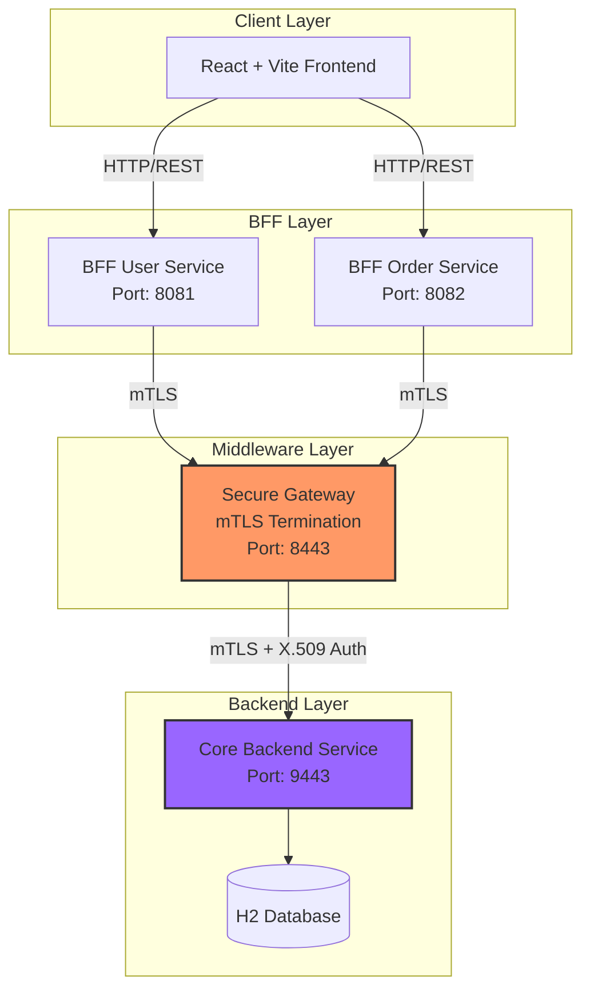

# 📘 TelecomPro Technical Documentation

Welcome to the technical deep-dive of the **TelecomPro Enterprise Platform**. This document provides a code-level explanation of the architecture, security, and implementation details.

---

## 🏗️ System Architecture

The system follows a **Microservices-based Layered Architecture** secured by **Mutual TLS (mTLS)**.



---

## 🔐 Security & mTLS Implementation

Security is the backbone of this platform. We strictly enforce **Mutual TLS (mTLS)** between internal services.

### 1. Certificate Authority & Trust
All services (BFFs, Middleware, Backend) possess certificates signed by a local **Certificate Authority (CA)**. This ensures that only trusted services can communicate.

### 2. Middleware Gateway (mTLS Termination)
The **Middleware** acts as the gatekeeper. It validates the client certificate (from BFFs) and forwards the request to the backend.

**File:** `middleware/.../config/SecurityConfig.java`

```java
@Bean
public SecurityFilterChain filterChain(HttpSecurity http) throws Exception {
    http
        // ...
        .authorizeHttpRequests(auth -> auth
            .requestMatchers("/gateway/**").authenticated() // Require Auth
            .anyRequest().permitAll()
        )
        .x509(x509 -> x509
            .subjectPrincipalRegex("CN=(.*?)(?:,|$)") // Extract CN as Username
            .userDetailsService(x509UserDetailsService())
        );
    return http.build();
}
```

**File:** `middleware/.../controller/GatewayController.java`

The controller checks the `Principal` (extracted from the certificate) before proxying.

```java
public Mono<ResponseEntity<String>> proxyRequest(..., Principal principal) {
    // 1. Validate Certificate Presence
    if (principal == null) {
        return Mono.just(ResponseEntity.status(401).body("mTLS required"));
    }

    // 2. Forward with Identity Headers
    return backendWebClient
            .method(method)
            .header("X-Client-CN", principal.getName()) // Pass identity to Backend
            .retrieve()
            .toEntity(String.class);
}
```

### 3. Backend Security
The Backend is also secured with SSL but trusts the Middleware's certificate. It can trust the `X-Client-CN` header because the connection is secured via mTLS.

---

## 💻 Backend Implementation Details

The Core Backend (`com.telecom.enterprise.backend`) handles the business logic.

### Order Management Flow
**File:** `backend/.../service/OrderService.java`

The `createOrder` method is transactional and handles inventory, pricing, and clearing the cart.

<details>
<summary>Click to view <code>createOrder</code> logic</summary>

```java
@Transactional
public OrderDTO createOrder(CreateOrderRequest request) {
    // 1. Validate User
    User user = userRepository.findById(request.getUserId())...

    // 2. Build Order Object
    Order order = Order.builder()
            .orderNumber("ORD-" + UUID.randomUUID()...)
            .status(Order.OrderStatus.PENDING)
            .build();

    // 3. Process Items & Calculate Totals
    BigDecimal subtotal = BigDecimal.ZERO;
    for (OrderItemRequest itemRequest : request.getItems()) {
        Product product = productRepository.findById(...)
        // Calculate item total
        BigDecimal itemTotal = product.getPrice().multiply(...);
        subtotal = subtotal.add(itemTotal);
        // Add to order...
    }

    // 4. Calculate Tax & Final Total
    BigDecimal tax = subtotal.multiply(TAX_RATE);
    order.setTotal(subtotal.add(tax).add(SHIPPING_COST));

    // 5. Save & Clear Cart
    orderRepository.save(order);
    cartRepository.findByUserId(user.getId()).ifPresent(c -> c.getItems().clear());

    return toDTO(order);
}
```
</details>

---

## 🌐 Frontend State Management

The frontend uses **Zustand** for global state management, persisting user sessions and cart data to local storage.

**File:** `frontend/src/store/index.ts`

### Cart Store
The cart logic is encapsulated in a hook-based store.

```typescript
export const useCartStore = create<CartState>()(
  persist(
    (set) => ({
      cart: null,
      setCart: (cart) => set({ cart }),
      clearCart: () => set({ cart: null }),
    }),
    { name: 'cart-storage' } // Persist to localStorage
  )
)
```

### Unified Store Hook
A wrapper hook `useStore()` combines Auth, Cart, and Theme stores for easy access in components.

```typescript
export function useStore() {
  const authStore = useAuthStore()
  const cartStore = useCartStore()

  return {
    user: authStore.user,
    cart: cartStore.cart,
    addToCart: (item: CartItem) => {
      // Logic to add item or update quantity locally
      // ...
    }
  }
}
```

---

## 🔄 Request Flow Example: "Place Order"

1.  **User** clicks "Place Order" in `CheckoutPage.tsx`.
2.  **Frontend** calls `BFF-Order` at `POST /api/orders`.
3.  **BFF-Order** receives the request. It constructs a request to the Core Backend.
4.  **BFF-Order** calls `https://localhost:8443/gateway/api/v1/orders` (Middleware).
    *   *Security*: Uses its Client Certificate (`CN=bff-order`).
5.  **Middleware** accepts connection (mTLS Handshake).
    *   *Auth*: Extracts `CN=bff-order` from certificate.
6.  **Middleware** proxies to `https://localhost:9443/api/v1/orders` (Backend).
    *   Adds Header: `X-Client-CN: bff-order`.
7.  **Backend** `OrderController` receives request.
8.  **Backend** `OrderService` processes the transaction (DB Save).
9.  **Response** travels back: Backend -> Middleware -> BFF -> Frontend.

---

## 🚀 Getting Started

Refer to the main `README.md` for setup instructions.
